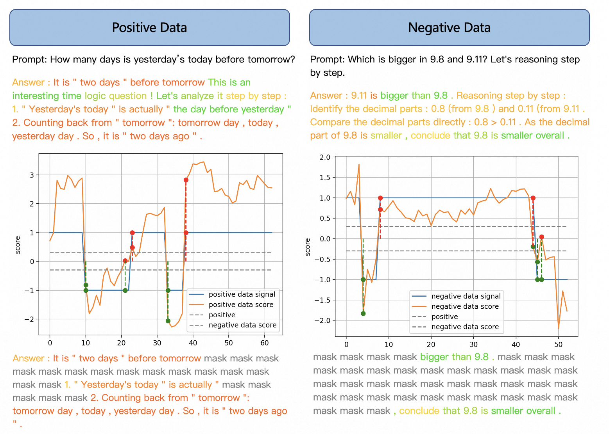

# Equilibrate RLHF Framework

Welcome to the Equilibrate RLHF Framework repository. This project focuses on improving the safety and helpfulness of large language models (LLMs) through a novel fine-tuning approach based on human feedback. Our project is build based on [OpenRLHF framework](https://github.com/OpenRLHF/OpenRLHF).

## Overview

Fine-tuning large language models (LLMs) based on human preferences, commonly achieved through reinforcement learning from human feedback (RLHF), has been effective in improving their performance. However, maintaining LLM safety throughout the fine-tuning process remains a significant challenge, as resolving conflicts between safety and helpfulness can be non-trivial. Typically, the safety alignment of LLM is trained on data with safety-related categories. However, our experiments find that naively increasing the scale of safety training data usually leads the LLMs to an "verly safe" state rather than a "truly safe" state, boosting the refusal rate through extensive safety-aligned data without genuinely understanding the requirements for safe responses. Such an approach can inadvertently diminish the models' helpfulness. To understand the phenomenon, we first investigate the role of safety data by categorizing them into three different groups, and observe that each group behaves differently as training data scales up. To boost the balance between safety and helpfulness, we propose an Equilibrate RLHF framework including a Fine-grained Data-centric (FDC) approach that achieves better safety alignment even with fewer training data, and an Adaptive Message-wise Alignment (AMA) approach, which selectively highlight the key segments through a gradient masking strategy. Extensive experimental results demonstrate that our approach significantly enhances the safety alignment of LLMs while balancing safety and helpfulness.

The System Flow Diagram of our proposed Equilibrate RLHF Framework is shown as follows:

The examples of Under safe, Truly safe and Over safe are shown as follows:

### Key Contributions

- **Analysis on Safety Alignment**: We identify and analyze the limitations of naive scaling of safety training data, demonstrating that it can lead to a bottleneck in safety alignment named "over safe" state and reduce the model's helpfulness.
- **Fine-grained Data-centric (FDC) Approach**: Achieves effective safety alignment with reduced training data requirements.
- **Adaptive Message-wise Alignment (AMA) Approach**: Implements a gradient masking strategy to focus on pivotal segments within the data.

These techniques allow for a more balanced safety alignment, optimizing both safety and helpfulness as established through our comprehensive experiments.

## Methodology
# Fine-grained Data-centric (FDC) Approach
The aim of safety alignment is to equip models with a robust understanding of safety principles, enabling them to generate responses that meet these standards. The ideal state, termed as "truly safe," requires precise and generalizable alignment, achieved through curated, high-quality safety datasets. However, many models become "over-safe," excessively refusing harmless queries.

Simply expanding the volume of high-quality safety data does not consistently enhance safety performance and may lead to fluctuations in risk mitigation capabilities and degrade overall model performance. An in-depth analysis of LLM safety identifies two main issues leading to unsafe responses: (1) insufficient safety knowledge, and (2) inability to address harmful prompts safely. Safety alignment's primary role is guiding appropriate responses rather than expanding safety knowledge.

We categorize LLM prompts into three groups:

Explicit Harmful Data (EHD): Contains harmful content like slurs without malicious intent. Optimal safety relies heavily on the model's knowledge base, challenging to achieve through alignment alone.
Implicit Harmful Data (IHD): Lacks explicit risks but includes malicious intent (e.g., insults, sarcasm). Effective alignment can be achieved through extensive post-training.
Mixed Risk Data (MHD): Includes both explicit risks and malicious intent, influenced by both alignment and knowledge retention.

# Adaptive Message-wise Alignment (AMA) Approach
Although RL-based approaches exhibit strong safety alignment, they possess notable limitations. Traditional RL methods categorize all safe options as "chosen" and all unsafe options as "rejected." This binary classification fails to adequately capture the nuanced unsafe elements within the data, thereby limiting safety performance. Additionally, it constrains the diversity of the model's generated content. Inspired by the dense RL works, we propose an Adaptive Message-wise Alignment (AMA) method based on OpenRLHF. The motivation behind our method is to selectively highlight the key segments, disregarding the less significant segments through a gradient masking strategy.
Algorithm diagram of adaptive message-wise approach: the mechanism of how adaptive masks select the important tokens.

## Usage

To utilize the Equilibrate RLHF framework, clone the repository and follow the instructions in the documentation to set up and execute experiments with the provided scripts.

## Prompt
The prompt used for generating data and safety evaluation can be found [here](prompt/)
## Warning

This project includes example data that may be offensive or harmful. Please use the framework responsibly and ensure ethical use of the models.

## Datasets

-- [Beavertail-30k-test](https://huggingface.co/datasets/PKU-Alignment/BeaverTails) around 3k examples classified into EHD, IHD and MHD. [Here are the data](dataset/beavertails_selected_relabelled.json)

-- [Wildchat](https://huggingface.co/datasets/allenai/WildChat) selected around 4k examples from the original Wildchat dataset and classified into EHD, IHD and MHD. [Here are the data](dataset/wildchat_selected_relabelled.json)

-- Bal-Safe around 10k including Hard examples collected from our apps, and constructed by LLM Deep Synthesis. (Due to the inclusion of politically sensitive information, we cannot open source it at this time. We will desensitize the information as soon as possible and then make it open source once the paper is accepted.)

- [C-Eval](https://cevalbenchmark.com/): Pass@1 scores on 5-shot.
- [C3](https://github.com/nlpdata/c3): Pass@1 scores on 0-shot.
- [MMLU](https://huggingface.co/datasets/cais/mmlu): Pass@1 scores on 0-shot.
- [CommonsenseQA](https://huggingface.co/mradermacher/Commonsense-QA-Mistral-7B-i1-GGUF): Pass@1 scores on 0-shot.
- [Race](https://huggingface.co/datasets/ehovy/race): Pass@1 scores on 0-shot.
- [ARC-C](https://huggingface.co/datasets/allenai/ai2_arc): Pass@1 scores on 0-shot.
- [ARC-E](https://huggingface.co/datasets/allenai/ai2_arc): Pass@1 scores on 0-shot.
- [BBH](https://huggingface.co/datasets/lukaemon/bbh): Pass@1 scores on 0-shot.
- [HellaSwag](https://huggingface.co/datasets/Rowan/hellaswag): Pass@1 scores on 0-shot.
- [WinoGrande](https://huggingface.co/datasets/allenai/winogrande): Pass@1 scores on 0-shot.
- [GSM8K](https://huggingface.co/datasets/openai/gsm8k): Pass@1 scores on 0-shot.
- [HumanEval](https://huggingface.co/datasets/openai/openai_humaneval): Pass@1 scores on 0-shot.

## Experimental verification

We evaluated our proposed FDC+ADPO method on LLAMA3-8B-instruct and Qwen2-7B-instruct models, focusing on both safety and general performance. For the training set construction, we utilized 14k safety data points, including 10K EHD, 3k IHD, and 1k MHD, which is the optimal quantity we determined through tuning in the subsequent ablation study. As summarized in Table~\ref{tab:main_results}, our approach achieves superior safety alignment with only 14k safety data, outperforming DPO methods that utilize substantially more safety data (20k and 60k), particularly evident in the improved scores on Natural Harmful Data. For instance, achieving a safety score of 0.9020 on LLAMA3-8B-instruct compared to DPO's 0.7750 with 60k safety data. Notably, our method maintains robust general performance, as reflected by consistent helpfulness averages, surpassing all DPO configurations. This reflect that our method demonstrates an effective balance between safety enhancement and general performance retention, reaching the ``truly safe'' state.
